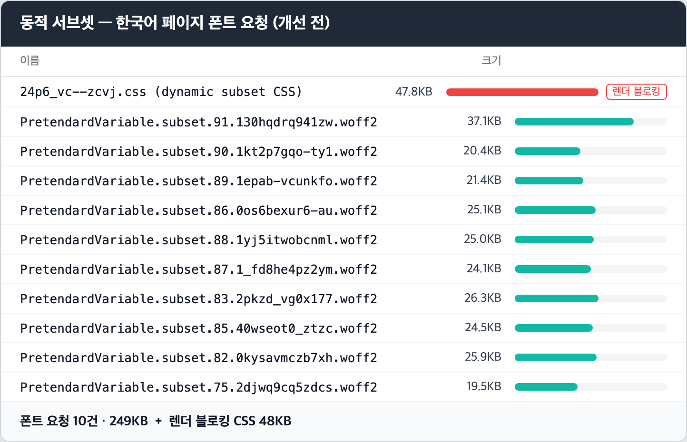
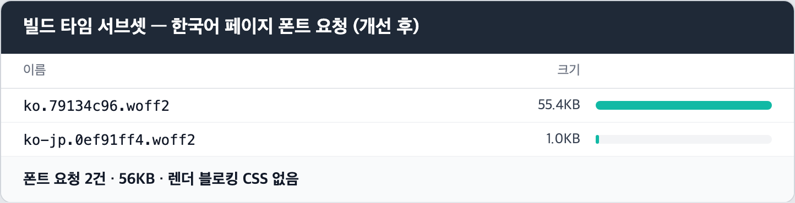

회사에 인턴십으로 합류해 회사 서비스를 소개하는 랜딩페이지 개발을 진행했습니다. 개발을 진행하던 중 평소 관심을 가지고 있던 성능 최적화를 랜딩페이지에 적용하고 싶은 생각이 들었고 이를 실제로 시도해 봤습니다.

이 글은 폰트 최적화 작업을 하며 겪었던 문제와 이를 해결한 방법을 정리한 글입니다.

## 해골물 Pretendard

랜딩페이지는 Pretendard 폰트를 사용하고 있었습니다. 아니, 사용하고 있는 줄 알았습니다. 전역 theme에 Pretendard가 선언되어 있었지만 정작 폰트 파일을 불러오는 코드가 없어 시스템 폰트로 폴백되고 있었습니다. 잘 쓰고 있다고 믿었던 폰트가 알고 보니 해골물이었던 셈입니다.

같은 헤드라인인데 폴백 상태(왼쪽)는 글자 폭이 좁고 자간이 벌어져 시안과 다르게 렌더링됩니다.

### 가변 폰트 단일 파일 추가

이 문제를 해결하는 가장 간단한 방법은 Pretendard를 의존성에 추가하고 next/font/local로 로드하는 것이었습니다. 하지만 한글 가변 폰트는 단일 woff2 파일이 2MB나 됩니다. 이 파일을 통째로 내려받게 하면 폰트를 얻는 대신 초기 로딩을 크게 희생해야 했습니다.

## 동적 서브셋 도입

그래서 단일 파일을 여러 파일로 조각을 내서 실제로 사용하는 부분만 가져오는 동적 서브셋 방법을 도입하였습니다. 2MB짜리 파일을 쪼개서 필요한 조각만 가져오니 당연히 성능이 개선될 거라고 생각했습니다. 하지만 Lighthouse로 측정한 값은 제 생각과는 정반대였습니다.

### 한글에서는 다르게 동작하는 동적 서브셋

동적 서브셋은 검증된 최적화 방법이지만, 그 효과는 영어(라틴 문자)처럼 글자 수가 적은 언어에서 가장 큽니다. 영어는 알파벳과 특수문자를 포함해도 100자 안팎이라 조각 몇 개면 충분합니다. 반면 한글 완성형은 11,172자나 되고, 실제 문장에 자주 쓰이는 글자들은 유니코드 블록 곳곳에 흩어져 있습니다. 글자의 사용 빈도가 코드 배열 순서와는 무관하기 때문입니다.

글자들이 이렇게 흩어져 있다 보니 짧은 문장 하나도 여러 조각에 걸치게 되고, 실제로 랜딩페이지는 서브셋 10개(252KB)를 내려받고 있었습니다.

 2MB보다는 분명 작아졌지만 요청이 10번으로 늘어났고, 여기에 다음 문제까지 겹치면서 최적화 방법을 썼는데 오히려 화면이 늦게 뜨는 이상한 상황이 벌어진 것이었습니다.

### @font-face의 렌더 블로킹

두 번째 문제는 동적 서브셋 CSS 자체였습니다. 11,172자를 여러 서브셋으로 나누다 보니 @font-face 선언이 92개나 되었고, 이 선언을 담은 CSS만 49KB였습니다. 브라우저는 head에서 불러오는 스타일시트를 다 받기 전까지 화면을 그리지 않습니다. 즉 폰트 조각을 받기도 전에 49KB짜리 CSS를 내려받는 동안 첫 화면이 멈춰 있었던 것입니다.

Lighthouse는 이 CSS가 렌더링을 약 155ms 붙잡고 있다고 지목했습니다. 동적 서브셋이 만든 문제 중 가장 큰 부분이었습니다.

## 빌드 타임 서브셋 도입

위에서 발견한 문제를 해결하기 위해 빌드 타임에 서비스에서 실제로 사용하는 글자만 추출하여 woff2 파일로 만들어 사용하는 빌드 타임 서브셋을 도입하였습니다. 마침 서비스가 다국어 라이브러리로 next-intl을 사용하고 있어 화면에 나오는 문자열이 전부 번역 리소스(messages JSON)에 모여 있었습니다. 빌드가 시작되면 스크립트가 로케일별 messages JSON에서 글자를 모으고, subset-font(HarfBuzz WASM)로 그 글자만 담은 woff2를 로케일마다 생성합니다.

같은 한국어 페이지의 폰트 요청이 10건에서 2건으로, 전송량은 56KB로 줄었습니다.

대신 한 가지 전제가 생겼습니다. 화면에 노출되는 문자열은 반드시 번역 리소스에 있어야 한다는 것입니다. 컴포넌트에 직접 쓴 글자는 서브셋에 포함되지 않아 시스템 폰트로 떨어집니다.

### Pretendard JP의 필요성

빌드 타임 서브셋을 도입한 후 문제가 해결된 줄 알았으나, 숨어 있던 문제가 드러났습니다. 일본어 한자 상당수가 애초에 Pretendard에 없는 글자라 시스템 폰트로 폴백되고 있었습니다. 서브셋이 만든 문제가 아니라 Pretendard를 쓰는 동안 계속 있었던 문제인데, 글자 단위로 폰트를 들여다보면서 비로소 눈에 띈 것입니다.

이를 해결하기 위해 의존성에 Pretendard JP를 추가하고 스크립트 로직을 수정했습니다. 빌드 시점에 로케일별 번역 리소스를 순회하다가 Pretendard의 cmap에 없는 글자를 만나면, 그 글자만 Pretendard JP에서 뽑아 보조 서브셋을 만들도록 했습니다.

## 결론

빌드 타임 서브셋을 도입하니 동적 서브셋에서 252KB였던 초기 폰트 전송량이 ko 56KB / en 34KB / vi 37KB / ja 71KB (198KB, **-21.43%**)로 줄고 렌더 블로킹 CSS 49KB를 제거할 수 있었습니다.

Lighthouse 측정 결과(로컬 production·Mobile 3회 중앙값 기준) Performance 78 → 92 (+**17.95%)**, FCP 2.72초 → 1.06초 (-**61.03%)**, LCP 4.82초 → 3.43초 (-**28.84%)**, 전송량 633KB → 424KB **(-33.02%)** 로 개선되었습니다. 다만 LCP는 여전히 목표치인 2.5초에 미치지 못했는데, 남은 병목은 폰트가 아니라 초기 JS라 다음 작업으로 남겨두었습니다.

성능 최적화 작업을 하며, 현재 프로젝트의 상황에 적절한 최적화 방법을 선택하는 것이 중요하다는 것을 배웠습니다. 긴 글 읽어주셔서 감사합니다.
